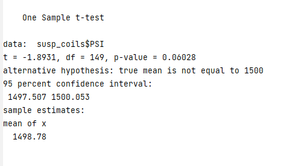
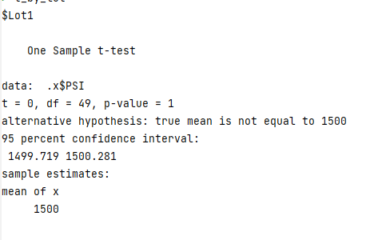
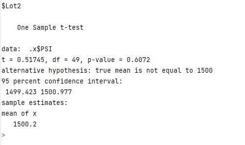
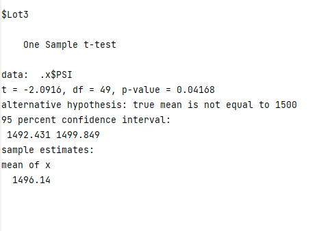

# MechaCar Statistical Analysis

## Linear Regression to Predict MPG

In our analysis of variables that can be used to predict fuel efficiency (in mpg),
the following two variables were found to be statistically significant:
- vehicle_length
- ground_clearance

The slope of the regression line was also found to be statistically significant.
Given the statistical significance of the intercept, we can say with confidence
that it's not equal to zero.

With an adjusted R-squared of 0.6825, we can conclude that the model does have
reasonable predictive power for the mpg of MechaCar prototypes.

## Summary Statistics on Suspension Coils

In the analysis of 3 suspension coil manufacturing lots it was determined that one
of the lots, Lot3, does not meet the design specification.
The design spec requires that the variance of coil PSI can't exceed 100.
As can be seen below, at the aggregate level (all lots combined) the combined
lots do meet the requirement,but when analyzed by lot, as noted, Lot3 falls outside the
desired tolerance.

### Overall Summary:

### Lot Summary:

## T-Tests on Suspension Coils

T-tests were performed across the suspension coil manufacturing lots to determine
whether the mean PSI overall, and for each lot, was different from an expected 1500 PSI.
As seen in the first result below, the overall (i.e. combined) mean was not determined to be statistically different
from 1500.

At the lot level, for Lot 1 and Lot 2, we fail to reject the null hypothesis that mean coil PSI
is different from 1500, but for Lot 3, we do reject the null, so conclude that the mean for Lot 3
is statistically different from 1500.  This is consistent with our variance results for Lot 3 as well.
T-test results for each lot are shown below:

## Study Design: MechaCar vs Competition

A statistical analysis to compare the **total cost of ownership** of a MechaCar
to competitors would consider the following cost variables:
- Regular Maintenance
- Repair
- Fuel

We'll ignore other typical ownership costs, such as licensing fees, insurance and depreciation,
as they are less directly related to the mechanics of the vehicle.

Regular maintenance is defined as the costs associated with keeping the vehicle runinng well,
and includes consumables such as oil changes, tire rotation and replacement and brake replacement.
Repair is defined as all other mechanical expenses incurred by an owner, excluding accident repair.
Fuel cost is defined as the total cost of fuel per kilometer driven. 

The above data could be obtained from a consumer survey, such as those done by consumerreports.org.
Data would be divided by manufacturer for each variable.
Comparing each of these *continuous* variables would be done using *two-tailed* (to avoid ethical concerns) *two-sample* **t-Testing**.
In each case, we would compare the mean of the MechaCar variable to a competitor.

The null hypothesis would be that the mean Regular Maintenance/Repair/Fuel costs of a MechaCar is not
statistically different from a competitor.  The alternative would be that there is a statistically signifncant
difference.

We may also test the MechaCar variables against an average of all other competitors, using a similar test set up,
to determine how the MechaCar compares to the industry overall. 
