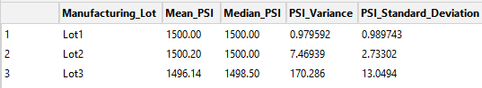

# MechaCar_Statistical_Analysis

## Linear Regression to Predict MPG

In our analysis of variables that can be used to predict fuel efficiency (in mpg),
the following two variables were found to be statistically significant:
- vehicle_length
- ground_clearance

The slope of the regression line was also found to be statistically significant.
Given the statistical significance of the intercept, we can say with confidence
that it's not equal to zero.

With an adjusted R-squared of 0.6825, we can conclude that the model does have
reasonable predictive power for the mpg of MechaCar prototypes.

## Summary Statistics on Suspension Coils

In the analysis of 3 suspension coil manufacturing lots it was determined that one
of the lots, Lot3, does not meet the design specification.
The design spec requires that the variance of coil PSI can't exceed 100.
As can be seen below, at the aggregate level (all lots combined) the combined
lots do meet the requirement,but when analyzed by lot, as noted, Lot3 falls outside the
desired tolerance.

### Overall Summary:

### Lot Summary:

